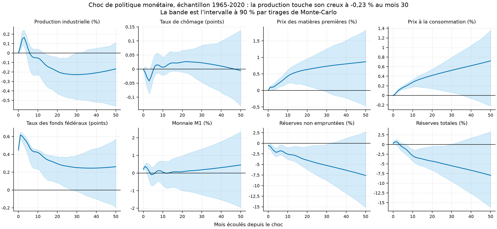
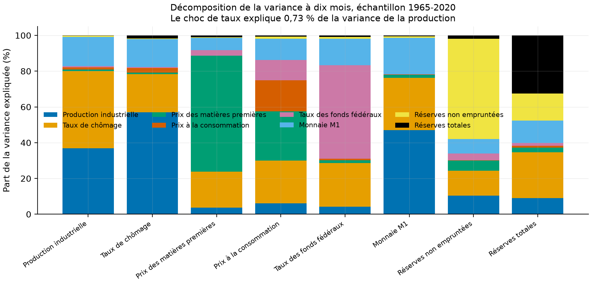
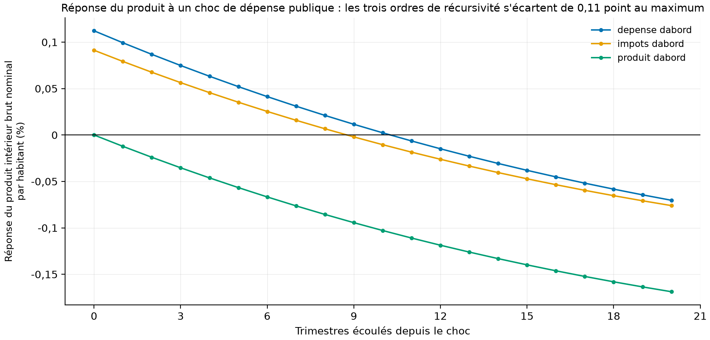

# Un choc de taux, un choc de dépense : ce que deux SVAR disent, et ce qu'ils disent de moins depuis 1983

Travail pratique remis le 16 décembre 2021 à Alain Guay, dans le cours *Applications de modèles
économiques* (ECO8086, UQAM), porté de R vers Python et rendu reproductible : les seize séries
viennent de FRED par script, et chaque figure se régénère d'une commande.

[](https://github.com/Guilou001/uqam-svar-monetaire-budgetaire/actions/workflows/ci.yml)


Le même contenu en PDF : [rapport/rapport.pdf](rapport/rapport.pdf).

**Résultat en une phrase.** Le schéma de Christiano, Eichenbaum et Evans se retrouve trait pour trait
sur 1965-2020 : la production monte pendant cinq mois avant de tomber, jusqu'à **-0,23 %** au mois 30,
et les prix montent au lieu de baisser, l'énigme que le travail de 2021 signalait déjà. La coupure
d'échantillon dit le reste : avant 1983 un choc de taux creuse la production de **-0,85 %** en onze
mois, entre 1983 et 2007 il ne la fait **jamais passer sous son niveau de départ**. Côté budgétaire,
l'ordre de récursivité décide du signe : la dépense publique élève le produit de **+0,11 %** quand
elle est ordonnée en premier et de **0,00 %** par construction quand le produit l'est.

*English summary.* A recursive SVAR on eight US monthly series, 1965-2020, reproduces the Christiano,
Eichenbaum and Evans (1999) pattern: industrial production rises for five months, then falls to
-0,23 % at month 30, while consumer prices rise, the price puzzle the 2021 coursework already flagged.
Splitting the sample sharpens the point: before 1983 a policy shock cuts production by 0,85 % within
eleven months; from 1983 to 2007 production never drops below its starting level. In the fiscal block,
the recursive ordering decides the sign of the impact response, from +0,11 % to exactly zero. Two
substitutions are declared: the Wu-Xia shadow rate is not downloadable by script, and Guay's fiscal
database is not public, so government spending is rebuilt from the FRED aggregate that equals the sum
of its seven components.

## 1. La question posée

Quand la banque centrale relève son taux, que devient l'économie, et la réponse est-elle la même
aujourd'hui qu'avant 1983 ? Et quand l'État dépense un dollar de plus, le produit monte-t-il, ou bien
la réponse dépend-elle seulement de l'hypothèse qu'on a posée pour la calculer ?

En mots simples : ces deux questions se ressemblent, et la seconde est un avertissement sur la
première. Un modèle qui sépare les causes ne le fait jamais tout seul, il le fait sous une hypothèse
que l'économiste choisit, et cette hypothèse se voit dans le résultat.

L'hypothèse en question s'appelle l'**identification récursive**. On range les variables dans un
ordre, et on décide qu'une variable ne réagit dans le mois à un choc que si elle vient après lui dans
cet ordre. La production ne voit pas le taux du mois même, mais les réserves bancaires le voient.

## 2. La méthode et les conclusions de 2021

### Ce que l'énoncé demandait

> Considérez les mêmes variables que CEE (1999, voir le texte de V. Ramey) avec le même schéma
> d'identification.

### Les données du travail

> Les données brutes proviennent du site web de V.A Ramey (2021). L'échantillon téléchargé couvre la
> période de 1965 à 2015 mensuellement. Nous avons mis à jour ces variables jusqu'à 2020m6 en
> utilisant le siteweb de la FRED (2021). Les données sont transformées en logarithme à l'exception de
> ceux en taux. Certaines variables contenaient des valeurs manquantes donc nous avons rempli ces
> valeurs manquantes avec l'algorithme EM (Expected maximisation).

### Ce que le choc monétaire donne sur l'échantillon complet

> On peut noter pour la fonction de réponse de LIP, lors des 5 premiers mois, le choc monétaire fait
> augmenter la variable LIP. Puis, on observe que LIP diminue du 6e au 20e mois en passant sous son
> niveau initial(période 0) pour augmenter légèrement du 21e au 50e mois en restant sous son niveau
> initial. D'un point de vue économique, la réaction à long terme est constante avec la théorie
> économique. Un choc de politique monétaire aurait certainement un effet négatif sur la production
> industrielle.

### Pourquoi les sous-échantillons diffèrent

> Cela dit,on peut conclure que les décompositions de la variance pour chaque échantillon sont
> statistiquement différentes. En effet, si nous comparons seulement le LIP entre ces trois
> échantillons, à l'exception de l'horizon un, les résultats sont très différents, et les variables qui
> expliquent la variation du LIP changent également. Ily a un grand nombre de raisons qui pourraient
> expliquer ces différences. D'une part, le changement de régime de la FED pourrait en être une. En ce
> sens, un changement d'objectif et de comportement de l'institution monétaire pourrait modifier la
> relation entre les variables.

### Le bloc budgétaire, et le jugement porté sur les trois ordres

> En considérant un choc structurel budgétaire (G), les fonctions de réponses pour T et G sont
> cohérentes. Si on se concentre sur l'effet sur l'output, on voit que les dépenses gouvernementales
> augmentent ce dernier, mais la hausse n'est qu'éphémère. Cela fait du sens, car bien que les dépenses
> gouvernementales augmentent l'output, elles ne sont pas source de croissances à long terme.
>
> (G, T, Y) : Ce schéma est plausible, Y reçoit l'effet contemporain de chocs fiscaux et budgétaires ce
> qui est cohérent. La relation contemporaine entre T et G est plus nébuleuse. Il semble plus logique
> que les dépenses gouvernementales soient affectées par un choc fiscal que l'alternative.
>
> (Y, G, T) : Il semble peu plausible que G et T n'aient pas d'effet contemporain sur Y. Les dépenses
> gouvernementales entrent directement dans l'output et les agents économiques réagissent rapidement à
> un choc fiscal et leur comportement aurait fort probablement un effet contemporain sur l'output.

## 3. Les données, et les deux substitutions déclarées

Le code R de 2021 lisait deux classeurs déposés à la main, et aucun des deux n'est public.

| Bloc | Contenu | Fenêtre | Observations |
|---|---|---|---:|
| Mensuel | production industrielle, chômage, prix des matières premières, prix à la consommation, taux des fonds fédéraux, monnaie M1, réserves non empruntées, réserves totales | 1965-01 à 2020-06 | 666 |
| Trimestriel | dépense publique, recettes nettes, produit intérieur brut, tous réels et par habitant | 1960T1 à 2015T3 | 223 |

Comment lire ce tableau, en deux constats. Le premier est que les deux fenêtres tombent exactement sur
celles du code de 2021, qui les écrivait en positions de ligne, `X[1:666]` et `dt.Q[53:275,]`. Le
second est que les huit variables mensuelles sont celles de Christiano, Eichenbaum et Evans, rangées
dans leur ordre de récursivité : les quatre lentes d'abord, le taux directeur au milieu, les trois
variables financières ensuite.

**La dépense publique de Guay, remplacée par une somme identique.** Le code de 2021 formait la dépense
en additionnant sept postes, `wage + durable + nondurable + service + structure + equip + intel`.
Cette somme est, poste pour poste, la consommation publique augmentée de l'investissement public, que
FRED publie déjà agrégée sous `GCE`. La substitution est une agrégation équivalente, pas une
approximation. Les recettes nettes suivent la même définition qu'en 2021, les recettes courantes moins
les transferts, les intérêts versés et les subventions.

**Le taux fantôme de Wu et Xia, non trouvé.** Le travail employait cette série comme quatrième
variante monétaire. L'adresse de la Fed d'Atlanta renvoie une page HTML et non le classeur annoncé,
constat mesuré le 2026-08-29. Cette variante n'est donc pas reproduite, et elle n'est pas remplacée
par une série approchante.

**Onze cases comblées, et pourquoi.** Le code de 2021 appelait `imputePCA` sans dire ce qu'il
comblait. La reconstruction le montre : les onze valeurs manquantes sont toutes dans le logarithme des
réserves non empruntées, devenues **négatives de la fin de 2008 à 2010**, une conséquence directe des
prêts d'urgence de la Réserve fédérale. Ce dépôt les comble par la même méthode, une analyse en
composantes principales itérative à deux composantes.

## 4. La méthode, pas à pas

1. **Ranger les huit variables** dans l'ordre de récursivité de Christiano, Eichenbaum et Evans.
2. **Estimer un VAR à constante**, trois retards sur l'échantillon complet et deux sur chaque
   sous-échantillon, comme en 2021.
3. **Identifier les chocs par décomposition de Cholesky** de la covariance des résidus. Le code R
   passait par une matrice `Amat` triangulaire inférieure entièrement libre ; une telle matrice est
   l'inverse du facteur de Cholesky, et un test du dépôt vérifie cette identité à 1e-12.
4. **Tracer les réponses sur cinquante mois**, avec un intervalle à 90 % obtenu par 200
   rééchantillonnages.
5. **Décomposer la variance de prévision** à dix et à douze mois.
6. **Recommencer sur les trois sous-échantillons**, 1965-1982, 1983-2007 et 1983-2020.
7. **Refaire l'exercice sur le bloc budgétaire**, un VAR à un retard sur trois variables, dans les
   trois ordres que l'énoncé impose.

## 5. Les résultats

### Le choc monétaire, échantillon par échantillon

| Échantillon | Retards | Observations | Hausse du taux à l'impact | Creux de la production | Mois du creux | Prix à douze mois |
|---|---:|---:|---:|---:|---:|---:|
| 1965-2020 | 3 | 663 | +0,45 point | -0,23 % | 30 | +0,31 % |
| 1965-1982 | 2 | 214 | +0,66 point | -0,85 % | 11 | -0,12 % |
| 1983-2007 | 2 | 298 | +0,19 point | 0,00 % | jamais | +0,07 % |
| 1983-2020 | 2 | 448 | +0,18 point | -0,30 % | 50 | +0,09 % |

Comment lire ce tableau, en quatre constats. D'abord, le choc lui-même rétrécit : un écart type du
choc de taux vaut 0,66 point avant 1983 et 0,18 point après, ce qui dit d'abord que la politique
monétaire est devenue moins brutale. Ensuite, l'effet sur la production suit le même chemin, de
-0,85 % en onze mois à un creux qui n'existe plus du tout entre 1983 et 2007 : sur ce sous-échantillon
la réponse de la production ne descend jamais sous zéro en cinquante mois. Puis, l'énigme des prix, la
hausse du niveau des prix après un resserrement, est présente partout sauf sur 1965-1982, la période
où l'inflation était forte et la politique monétaire réactive. Enfin, le creux de -0,30 % sur
1983-2020 tombe au cinquantième mois, c'est-à-dire au bord de la fenêtre tracée : ce n'est pas un
creux, c'est le point le plus bas atteint avant l'arrêt du calcul.



Comment lire cette figure : un cadre par variable, les mois écoulés depuis le choc en abscisse. La
courbe est la réponse à un choc de taux d'un écart type, la bande son intervalle à 90 %. Les grandeurs
en logarithme sont converties en pourcentage, les taux restent en points. La production monte d'abord,
puis descend, et sa bande englobe zéro dès le vingtième mois : l'effet est net dans sa forme et
incertain dans son ampleur. Les prix à la consommation, en haut à droite, montent sans jamais
redescendre, ce qu'aucune théorie du resserrement monétaire ne prévoit.



Comment lire cette figure : chaque barre est une variable, chaque couleur la part de sa variance
d'erreur de prévision à dix mois attribuée à un choc. Une barre presque d'une seule couleur est une
variable qui s'explique surtout par elle-même. Le choc de taux explique la moitié de sa propre
variance et environ un dixième de celle des prix à la consommation.

### Ce que 2021 rapporte, et ce que 2026 retrouve

| Constat de 2021 | 2021 | 2026 |
|---|---|---|
| La production monte les cinq premiers mois, puis passe sous zéro | qualitatif | mesuré : maximum de +0,16 % au mois 3, passage sous zéro au mois 6 |
| Les prix montent après un resserrement | qualitatif | mesuré : +0,31 % à douze mois sur 1965-2020 |
| Part du chômage dans la variance de la production à douze mois, 1983-2020 | 50,8 % | 50,5 % |
| Part de la production elle-même, même case | 25,4 % | 39,0 % |
| Part des prix à la consommation, même case | 16,7 % | 0,7 % |
| Part de la dépense expliquée par elle-même à six trimestres, ordre (G, T, Y) | 98 % | 97,6 % |
| Part des recettes expliquée par le produit, six trimestres, même ordre | 42 % | 0,0 % |

Comment lire ce tableau, en trois constats. Le premier est que les constats qualitatifs se retrouvent
tous : la forme des réponses, l'énigme des prix, la domination de chaque variable par elle-même à
court horizon. Le deuxième est que deux cases numériques tombent presque exactement, la part du
chômage à 0,3 point près et la part de la dépense à 0,4 point près. Le troisième est que deux autres
divergent franchement, et il faut le dire tel quel : la part des prix dans la variance de la
production et la part du produit dans celle des recettes. La cause probable est la donnée elle-même,
puisque ni le fichier de Ramey ni la base de Guay ne sont ceux d'ici, mais rien dans ce dépôt ne le
démontre.

### Le bloc budgétaire, où l'ordre décide du signe

| Ordre de récursivité | Effet immédiat sur le produit | Effet à vingt trimestres | Choc d'impôt à vingt trimestres |
|---|---:|---:|---:|
| Dépense, impôts, produit | +0,11 % | -0,07 % | +0,10 % |
| Impôts, dépense, produit | +0,09 % | -0,08 % | +0,09 % |
| Produit, dépense, impôts | 0,00 % | -0,17 % | -0,22 % |

Comment lire ce tableau, en trois constats. Le premier est mécanique et sert de preuve que le code
fait ce qu'il annonce : dans le troisième ordre, le produit vient en premier, donc il ne peut pas
réagir dans le trimestre à un choc de dépense, et la case vaut exactement zéro. Le deuxième est que
les deux premiers ordres donnent presque le même chiffre, +0,11 % et +0,09 %, ce qui rassure sur la
partie du résultat qui ne dépend pas de l'hypothèse. Le troisième est que l'effet de long terme est
négatif dans les trois cas, ce que le travail de 2021 jugeait déjà peu conforme à Blanchard et
Perotti, et le classement de plausibilité qu'il proposait reste le bon guide de lecture.



Comment lire cette figure : les trois courbes sont la réponse du produit intérieur brut réel par
habitant à un choc de dépense publique d'un écart type, une courbe par ordre de récursivité. La courbe
qui part de zéro est celle où le produit est ordonné en premier, par construction. Les trois se
rejoignent après quelques trimestres, ce qui délimite ce que l'hypothèse d'identification décide
vraiment : le trimestre du choc, et lui seul.

## 6. Reproduire

```bash
uv sync --locked --all-extras
uv run pytest             # 9 tests fermés, sans réseau
uv run svr fetch          # seize séries de FRED, environ 0,2 Mo
uv run svr bases          # les deux fenêtres, et les cases comblées
uv run svr retards        # les critères d'information, comme VARselect
uv run svr lab            # les quatre SVAR monétaires et les trois budgétaires
uv run svr figures        # les six figures
```

Durée mesurée sur un processeur Apple M5 Pro : **16 secondes** pour `svr lab`, l'essentiel passant
dans les 200 rééchantillonnages qui donnent les intervalles.

## 7. Limites, avec leur statut

| Limite | Statut |
|---|---|
| Le taux fantôme de Wu et Xia n'est pas téléchargeable par script | mesuré le 2026-08-29 ; la quatrième variante monétaire du travail n'est pas reproduite, et aucune série approchante ne la remplace |
| La base budgétaire de Guay (2020) n'est pas publique | déclaré ; la dépense est reconstruite par l'agrégat `GCE`, qui est la somme exacte des sept postes du code de 2021 |
| Le prix des matières premières est ici l'indice des prix à la production, toutes marchandises | déclaré ; Christiano, Eichenbaum et Evans utilisent un indice de matières sensibles que FRED ne publie pas sous ce nom |
| Deux parts de variance divergent nettement de 2021, celle des prix dans la production et celle du produit dans les recettes | mesuré et non expliqué ; il faudrait les fichiers d'origine pour trancher |
| La monnaie M1 subit une rupture de définition en mai 2020, deux mois avant la fin de l'échantillon | déclaré ; le travail de 2021 portait la même rupture |
| L'identification récursive est une hypothèse, pas un résultat | reconnu ; c'est le sujet même du bloc budgétaire, où trois ordres donnent trois réponses immédiates différentes |
| Les intervalles viennent de 200 rééchantillonnages | déclaré ; leur graine est fixée à 20211216, la date de remise du travail |
| Aucun test de racine unitaire ni de cointégration | reconnu ; le travail de 2021 estimait aussi en niveaux, comme Blanchard et Perotti |

## 8. Crédits, licence, citation

Travail réalisé par **Guillaume Vaudescal**, remis le 16 décembre 2021. Cours ECO8086, *Applications
de modèles économiques*, donné par Alain Guay à l'UQAM. Le portage de R vers Python, la reconstruction
des données depuis FRED, les tests et la CI datent de 2026.

Code sous licence MIT.

## 9. Références

- Blanchard, O. et Perotti, R. (2002), « An empirical characterization of the dynamic effects of
  changes in government spending and taxes on output », *The Quarterly Journal of Economics*,
  vol. 117, n° 4, p. 1329-1368.
- Christiano, L. J., Eichenbaum, M. et Evans, C. L. (1999), « Monetary policy shocks: what have we
  learned and to what end? », *Handbook of Macroeconomics*, vol. 1, p. 65-148.
- Ramey, V. A. (2016), « Macroeconomic shocks and their propagation », *Handbook of Macroeconomics*,
  vol. 2, p. 71-162.
- Wu, J. C. et Xia, F. D. (2016), « Measuring the macroeconomic impact of monetary policy at the zero
  lower bound », *Journal of Money, Credit and Banking*, vol. 48, n° 2-3, p. 253-291.
